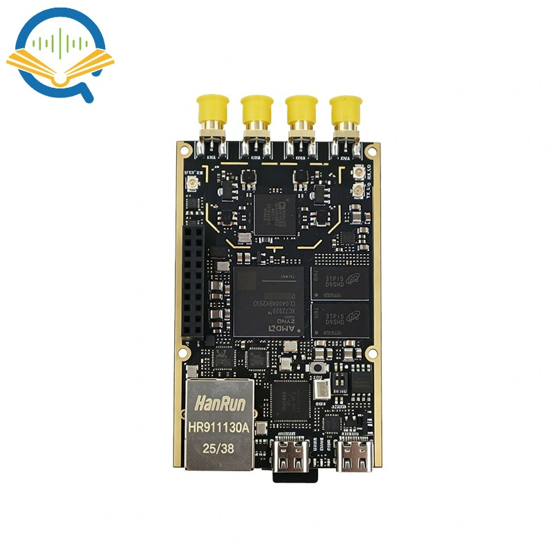

> **This is not the official Analog Devices / OpenSourceSDRLab repository.**
> The Fishball7020 is an ADALM-PLUTO-derivative board that ships with no
> published, editable firmware source of its own — this repository is an
> independent, reverse-engineered reconstruction of that firmware, built and
> verified to be as close to bit-perfect as is possible from public sources.
> See [How this repo came to exist](#how-this-repo-came-to-exist).

# Fishball7020 FPGA Devkit

<p align="center">
  
  
  
  
  <a href="../../actions/workflows/verify-patches.yml"></a>
</p>

<p align="center"></p>

Build your own custom FPGA/HDL firmware for the **"7020-SDR"** — a
Zynq XC7Z020-CLG400 + AD9361 software-defined radio board with dual TX/RX
(hence "Fishball7020"), also distributed as **"PlutoSky"** by
OpenSourceSDRLab.

> **This repo targets one exact board:** the one sold on AliExpress as
> [**"7020-SDR" (XC7Z020 + AD9361, dual TX/RX)**](https://nl.aliexpress.com/item/1005012055627197.html).
> Other Zynq/AD936x SDR boards — including the original ADALM-PLUTO
> (XC7Z010) — use different pin constraints and won't work with the HDL
> project or device tree built here without changes.

This repo takes you from a stock, unmodified board all the way to **your own
FPGA logic running inside it**: install Vivado, open the real block design,
add your HDL next to the AD9361 datapath, rebuild every layer of the
firmware (bitstream → FSBL → U-Boot → kernel → root filesystem), and flash
it back onto the board — via SD card or over USB (DFU), no disassembly
required either way.

| | |
|---|---|
| **Board** | Zynq-7020 (XC7Z020-CLG400) + AD9361, 2×2 MIMO RF front end |
| **Toolchain** | Xilinx Vivado/Vitis **2022.2** (free WebPACK license — no purchase needed) |
| **Host OS** | **Ubuntu 22.04 LTS** — the version Vivado/Vitis 2022.2 officially supports |
| **Firmware base** | Linux 5.15, U-Boot, Buildroot — a Zynq-7020 port of ADI's `plutosdr-fw` |
| **Verified against real hardware** | `devicetree.dtb` byte-identical; kernel, bootloader, rootfs content-identical — see [Provenance](#how-this-repo-came-to-exist) |

## What you get

- **A firmware build you can trust** — verified against a real unit:
  `devicetree.dtb` comes out byte-for-byte identical, the rootfs and
  bootloader environment content-identical.
- **One command builds every layer** — bitstream → FSBL → U-Boot →
  Linux 5.15 → Buildroot root filesystem → `BOOT.bin`.
- **The real ADI block design, editable** — open it in Vivado and put your
  own HDL directly into the AD9361 datapath.
- **Three ways onto the board** — SD card, DFU over USB, or JTAG for a
  seconds-long iteration loop instead of a full rebuild.
- **Your changes are reproducible** — they live in `patches/`, so a clean
  clone rebuilds them on any machine.
- **Free toolchain** — the XC7Z020 is covered by Vivado's no-cost WebPACK
  licence. No purchase, no licence file.
- **The traps are already handled** — Vivado `PATH` pollution breaking the
  kernel build, Buildroot mirror timeouts, host GCC version drift. Each one
  cost a debugging session; none of them will cost you one.

## Quick start

Assumes Vivado/Vitis 2022.2 is installed ([step 1](#1-install-vivadovitis-20222)
if not — it's the only slow part).

```bash
# run from: wherever you want the devkit to live (e.g. ~)
git clone https://github.com/matsvandamme/fishball7020-fpga-devkit.git
cd fishball7020-fpga-devkit/firmware

./scripts/setup.sh        # clone upstream source + apply patches  (~5 min)
./scripts/build_all.sh    # build everything                    (45-90 min)
```

You should end up with exactly five files:

```
$ ls output/
BOOT.bin  devicetree.dtb  uEnv.txt  uImage  uramdisk.image.gz
```

Copy all five onto a FAT32 SD card, insert, power on. Then jump to
[step 4](#4-add-your-own-hdl) to start changing the FPGA logic.

> **Back up first.** Before flashing anything, copy the five files already
> on your board's SD card somewhere safe — that's your one-click way back if
> a build misbehaves. No backup? See
> [recovery](#if-things-go-wrong-recovering-the-factory-firmware).

## Table of contents

- [What you get](#what-you-get) · [Quick start](#quick-start)
- [Requirements](#requirements)
- **Walkthrough** — [1. Install Vivado](#1-install-vivadovitis-20222) ·
  [2. Get the source](#2-get-the-firmware-source) ·
  [3. Open the block diagram](#3-open-the-block-diagram) ·
  [4. Add your own HDL](#4-add-your-own-hdl) ·
  [5. Build](#5-build-the-firmware) ·
  [6. Flash](#6-flash-the-board) ·
  [7. Verify](#7-verify-your-build-is-actually-running)
- [Repository layout](#repository-layout)
- [Troubleshooting](#troubleshooting)
- [How this repo came to exist](#how-this-repo-came-to-exist) ·
  [Vendor resources](#vendor-resources) · [License](#license)

## Requirements

**Hardware:**
- A Fishball7020 / PlutoSky board, a micro-USB cable, and a microSD card
  (any size — the image is small) with a USB card reader, **or** just the
  USB cable if you'll flash via DFU.

**Software** (Ubuntu 22.04 LTS; install before step 1):

```bash
# run on your HOST, from anywhere
sudo apt update
sudo apt install -y git build-essential bison flex libssl-dev \
    device-tree-compiler u-boot-tools dfu-util screen python3 xvfb \
    libgmp-dev libmpc-dev libmpfr-dev
```

- **No extra GCC needed on 22.04.** Jammy's default GCC 11 builds
  everything. One legacy Buildroot host tool (`host-m4`) fails under
  GCC ≥ 14's stricter C defaults, so *only* on a much newer distro do you
  also need `gcc-13`/`g++-13` alongside the default compiler. `build_all.sh`
  detects your GCC version and picks automatically — it never forces
  `gcc-13` on a host that doesn't need it (and jammy doesn't even package
  it).
- `device-tree-compiler` (`dtc`) and `u-boot-tools` (`mkimage`) are used to
  build the device tree and the ramdisk image.
- `dfu-util` and `screen` are only needed if you'll flash/debug over USB
  (steps 6B/7) rather than by copying files to an SD card.
- **`libgmp-dev`/`libmpc-dev`/`libmpfr-dev`** are needed by the kernel's
  GCC-plugin build (`scripts/gcc-plugins`), which `#include <gmp.h>`. Miss
  them and the build fails at stage 4 with `fatal error: gmp.h: No such file
  or directory`.
- **`xvfb` matters if you build headless** — over SSH, in CI, or on a box
  with no desktop. Vitis (`xsct`) needs an X display to build the FSBL: it
  uses `$DISPLAY` if one is set, and otherwise falls back to Xvfb. Without
  either, the build dies at stage 2 with a bare
  `ERROR: Xvfb is not available on the system`. `build_all.sh` now checks
  for this up front rather than letting you discover it 40 minutes in.

## 1. Install Vivado/Vitis 2022.2

The board's Zynq-7020 is fully covered by Xilinx's **free WebPACK
license** — no purchase or license file needed.

1. Create a free account at [xilinx.com](https://www.xilinx.com) (now AMD)
   and go to the [2022.2 downloads page](https://www.xilinx.com/support/download/index.html/content/xilinx/en/downloadNav/vivado-design-tools/2022-2.html).
2. Download the **Vitis** unified installer for Linux (not just Vivado —
   you need Vitis too, for the FSBL build in step 5). It's a single
   self-extracting `.bin` file.
3. Run it:
   ```bash
   # run from: wherever you downloaded the installer (e.g. ~/Downloads)
   chmod +x Xilinx_Unified_2022.2_*.bin
   ./Xilinx_Unified_2022.2_*.bin
   ```
4. In the installer GUI:
   - Choose **"Vitis"** as the product (this includes Vivado Design Suite,
     the Vitis IDE, and `xsct`).
   - Under device families, you only need **Zynq-7000** — deselecting
     everything else brings the download from ~130 GB down to ~30 GB.
   - **Keep the default install path**, `/tools/Xilinx` — this repo's
     `tools/env-vivado.sh` points there. If you install elsewhere, edit
     the two paths at the top of that file to match.
5. No license step is needed — WebPACK devices (which includes the
   XC7Z020) are auto-licensed.

**Why `tools/env-vivado.sh` exists:** Vivado 2022.2's bundled binaries are
linked against `libtinfo.so.5`, `libncurses.so.5`, and
`libssl.so.1.1`/`libcrypto.so.1.1` — legacy compatibility libraries not
present in a default Ubuntu 22.04 install. This script prepends
locally-vendored copies of exactly those libraries to `LD_LIBRARY_PATH`
before sourcing Vivado's own `settings64.sh`, without touching anything
system-wide. From here on, **always run `source tools/env-vivado.sh`
instead of Vivado's own `settings64.sh`**, in any shell where you'll run
`vivado`, `xsct`, or `bootgen` by hand.

## 2. Get the firmware source

```bash
# run from: wherever you want the devkit to live (e.g. ~)
git clone https://github.com/matsvandamme/fishball7020-fpga-devkit.git
cd fishball7020-fpga-devkit/firmware
./scripts/setup.sh
```

> **Where to run things:** from here on, every command runs from the
> **`firmware/`** directory unless the code block says otherwise —
> that's where `scripts/`, `patches/`, `src/` and `output/` live. Each
> block states its directory on the first line so you can never be in
> doubt. Commands that run *on the board itself* (over the serial
> console) are marked as such.

This clones the upstream source (a Zynq-7020 port of Analog Devices'
`plutosdr-fw`) into `src/` and applies this repo's `patches/` on top —
six real fixes plus the board's actual device tree (see the
[firmware README](firmware/README.md) for exactly
what each patch does and why). `src/` is gitignored and only exists on
your machine; re-run `setup.sh` any time you want a clean slate.

## 3. Open the block diagram

```bash
# run from: firmware/
source ../tools/env-vivado.sh
cd src/hdl/projects/pluto
vivado pluto.xpr
```

The first time, this project doesn't exist yet — only the `.tcl` scripts
that generate it (`system_project.tcl`, `system_bd.tcl`). Run
`./scripts/build_all.sh` once first (step 5) to create `pluto.xpr`, *then*
open it with the command above for subsequent edits.

Once Vivado's GUI is open: in the **Sources** panel, expand
**Design Sources → system_top → system_i** and click **Open Block Design**
to see the graphical canvas.

## 4. Add your own HDL

This project is not a bare "samples straight to DMA" design — Pluto's
reference architecture already threads channel 0 through Analog Devices'
programmable FIR decimator/interpolator, while channel 1 bypasses
filtering entirely:

```
                            AD9361 (physical LVDS pins)
                                    │
                             ┌──────▼───────┐
                             │  axi_ad9361   │
                             └──┬────────▲───┘
      RX ch.0: adc_data_i0/q0 ──┤         ├── TX ch.0: dac_data_i0/q0
      RX ch.1: adc_data_i1/q1 ──┤         ├── TX ch.1: dac_data_i1/q1
                                │         │
                    ┌───────────▼──┐   ┌──┴────────────┐
        ch.0 only:  │rx_fir_       │   │tx_fir_        │  ch.0 only:
     (decimation,   │decimator     │   │interpolator   │  (interpolation,
      8x, 2x taps)  └──────┬───────┘   └───────▲───────┘   2x/8x taps)
                           │                     │
      ch.1 connects  ┌─────▼──────┐       ┌──────┴─────┐  ch.1 connects
      directly, no   │   cpack     │       │  tx_upack  │  directly, no
      filter ────────►(util_cpack2)│       │(util_upack2)◄──── filter
                     └─────┬──────┘       └──────▲─────┘
                           │                       │
                    ┌──────▼──────┐         ┌──────┴──────┐
                    │  adc_dma     │         │  dac_dma     │
                    │ (axi_dmac)   │         │ (axi_dmac)   │
                    └──────────────┘         └──────────────┘
                     ▲ YOU ARE HERE — insert custom logic between
                     axi_ad9361 and cpack/tx_upack (channel 1),
                     or before/after the FIR blocks (channel 0)
```

**Where to insert your logic, depending on what you want:**

- **Channel 1** (`adc_data_i1`/`adc_data_q1` on RX, `dac_data_i1`/
  `dac_data_q1` on TX) **has no filter in the path at all** — it's wired
  directly between `axi_ad9361` and `cpack`/`tx_upack`. This is the
  cleanest insertion point if you don't want to touch existing IP: break
  the direct connection in the block design and insert your own block
  (mirroring the existing `ad_connect axi_ad9361/adc_data_i1
  <your_block>/data_in` calls in `system_bd.tcl`), then reconnect to
  `cpack`'s `enable_2`/`fifo_wr_data_2` (and `_3` for Q).
- **Channel 0** already routes through `rx_fir_decimator`/
  `tx_fir_interpolator` (ADI's `util_fir_int` IP, instantiated via
  `ad_add_decimation_filter`/`ad_add_interpolation_filter` in
  `system_bd.tcl`, coefficients from `library/util_fir_int/coefile_int.coe`).
  Insert before these blocks (raw, full-rate samples) or after (post-filter,
  right before `cpack`/after `tx_upack`) — or just replace the `.coe`
  coefficient file to change the filter's response without touching any
  wiring.
- Both channel-0 signal groups run on `axi_ad9361/l_clk` (the AD9361
  interface clock) — match that clock domain for anything you insert there.
- You can edit the block design graphically (drag in your own IP, wire it
  up, right-click → **Create HDL Wrapper**), or edit `system_bd.tcl`
  directly.

### Rebuilding after a GUI block-design edit

Your edit is picked up on the next build automatically — `build_hdl.tcl`
opens the existing `pluto.xpr` and does a full `reset_run synth_1`, so the
design is re-synthesised, re-implemented, and the new bitstream flows
through to `BOOT.bin`. Three things to do first:

1. **Save the block design** (`Ctrl-S`). An edit left unsaved on the canvas
   isn't in `pluto.xpr`, and the build will quietly produce firmware
   without it.
2. **Validate Design (F6)** — catches width/direction mistakes instantly
   instead of 15 minutes into synthesis.
3. **Close Vivado.** The GUI holds a lock on the project, and
   `build_all.sh` runs Vivado in batch mode against the same files.

```bash
# run from: firmware/
./scripts/build_all.sh
```

Note that GUI edits live in `src/`, which is gitignored and regenerated by
`setup.sh` — fine for iterating on your own machine, but to keep a change
long-term (or share it) port it into `system_bd.tcl` and add it to
`patches/`.

## 5. Build the firmware

```bash
# run from: firmware/
./scripts/build_all.sh
```

This single script runs every stage, in order, and leaves the final files
in `output/`:

| Stage | What it does |
|---|---|
| 1. HDL | Synthesizes and implements `pluto.xpr`, exports the hardware platform (bitstream included) |
| 1b. Toolchain | Builds Buildroot's own Linaro GCC 7.3 cross-compiler (once; skipped on later runs) |
| 2. FSBL | Scaffolds and compiles a fresh Vitis FSBL app from the hardware platform |
| 3. U-Boot | Built from `zynq_pluto_defconfig` (patched to match the real board's boot defaults) |
| 4. Kernel | Builds `uImage` + `zynq-pluto-sdr-fishball.dtb` (the device tree from `patches/0002`) |
| 5. Root filesystem | Buildroot; auto-retries through a known git-archive hash-drift issue |
| 6. `uEnv.txt` | Generated fresh from the just-built U-Boot's own compiled-in defaults |
| 7. Packaging | `bootgen` combines FSBL + bitstream + U-Boot into `BOOT.bin`; wraps the rootfs |

A full run takes roughly 45–90 minutes depending on your machine (HDL
synthesis/implementation and the Buildroot rootfs are the two long
stages). Every step re-runs on every invocation — there's no per-stage
skip logic — so editing `system_top.v` and re-running `build_all.sh` is
all you need to do after an HDL change; it reuses Vivado's incremental
synthesis under the hood, so only what actually changed gets rebuilt.

When it finishes, you'll have exactly these five files in `output/`:
`BOOT.bin`, `devicetree.dtb`, `uEnv.txt`, `uImage`, `uramdisk.image.gz`.

## 6. Flash the board

### Option A — SD card (always works)

Format a microSD card as a single FAT32 partition, then copy all five
files from `output/` onto it:

```bash
# run from: firmware/
cp output/{BOOT.bin,devicetree.dtb,uEnv.txt,uImage,uramdisk.image.gz} /path/to/sd-card/
```

Eject it, insert it into the board, and power-cycle. This is the only
option that can update **everything**, including the FPGA bitstream, and
it's the one to use whenever you've changed HDL.

### Option B — DFU over USB (no disassembly)

The board's U-Boot has USB DFU built in, letting you push new files onto
the SD card's FAT partition over the same micro-USB cable you use for
normal operation — no card removal needed. This path can update
`uImage`, `devicetree.dtb`, and `uramdisk.image.gz`, but it **cannot**
update `BOOT.bin` (there's no DFU target for the FPGA bitstream/FSBL/
U-Boot on this board) — for any HDL change, use Option A instead. DFU is
ideal for iterating on the kernel or rootfs without touching the SD card.

1. Connect the board over USB and open a serial console (see
   [step 7](#7-verify-your-build-is-actually-running) for how). Power-cycle
   the board and **press any key within 3 seconds** to stop autoboot at
   the `Zynq>` prompt.
2. Enter DFU mode:
   ```
   Zynq> run dfu_mmc
   ```
   The board is now waiting for USB DFU transfers (nothing more appears on
   the console).
3. From your host:
   ```bash
   # run from: firmware/output/  (on your HOST, not the board)
   dfu-util -l   # confirms you can see uImage / devicetree.dtb / uramdisk.image.gz
   dfu-util -D uImage             -a uImage
   dfu-util -D devicetree.dtb     -a devicetree.dtb
   dfu-util -D uramdisk.image.gz  -a uramdisk.image.gz
   ```
4. Back on the serial console, press **Ctrl+C** to exit the DFU wait loop,
   then reboot into your new files:
   ```
   Zynq> reset
   ```

### Option C — JTAG (temporary, but the fastest HDL loop)

For iterating on PL changes you can push a bitstream straight into the FPGA
over JTAG — seconds, instead of a full `build_all.sh` plus reflash. Two
things to be clear about: it is **volatile** (gone on power-cycle) and it
does **not** update `BOOT.bin`, so it's for testing, not deployment.

**Use the debug port** — JTAG is interface 0 on that connector. Keep the
USB 2.0 port connected as well if that's what powers your board.

**One-time setup.** Vivado ships udev rules for Digilent cables but doesn't
install them. Without them the USB node stays `crw-rw-r-- root root`, so
libusb can't claim the device and Vivado reports
`ERROR: [Labtoolstcl 44-199] No matching targets found`.

Run this **in a real terminal on the machine the board is plugged into** —
`sudo` needs a TTY, so it won't work through an IDE/agent shell, and rules
installed inside a VM have no effect on the host:

```bash
# run on your HOST, from anywhere
sudo cp /tools/Xilinx/Vivado/2022.2/data/xicom/cable_drivers/lin64/install_script/install_drivers/*.rules \
        /etc/udev/rules.d/
sudo udevadm control --reload-rules
sudo udevadm trigger
```

Now **unplug and replug the debug cable**, and verify (neither needs sudo):

```bash
# run on your HOST, from anywhere
ls /etc/udev/rules.d/ | grep xilinx
ls -la /dev/bus/usb/003/$(lsusb | grep 0403:6010 | sed -E 's/.*Device ([0-9]+).*/\1/')
```

You want two `.rules` files listed, and permissions **`crw-rw-rw-`** (three
`rw` groups). Then confirm Vivado sees the cable:

```tcl
open_hw_manager
connect_hw_server
get_hw_targets
open_hw_target
get_hw_devices
```

Expected — the Digilent cable, then the Zynq's ARM debug port and the PL:

```
localhost:3121/xilinx_tcf/Digilent/000000000069A
arm_dap_0 xc7z020_1
```

**Keep BOTH cables connected the whole time.** The debug port powers the
board (verified: JTAG reaches the Zynq with only that cable attached), and
the USB 2.0 port carries the network/libiio data. Since the bitstream is
volatile, unplugging the debug port to "move to" the USB 2.0 port would cut
power and lose it. Connect both up front and unplug nothing.

**Never program while Linux is running.** Its drivers (`ad9361`, the DMAs)
are bound to the *old* PL; swapping the bitstream underneath them will break
or hang the system and needs a power-cycle to recover.

### C1. Quick method — Hardware Manager, halted at U-Boot

1. Open the debug UART console, power-cycle, press a key within 3 s to stop
   at the `Zynq>` prompt. (The FSBL has now configured the PS and enabled
   the PS↔PL level shifters, but Linux hasn't claimed anything.)
2. Program — GUI: **Open Hardware Manager → Auto Connect → right-click
   `xc7z020_1` → Program Device**. Or scripted:

   ```tcl
   open_hw_manager
   connect_hw_server
   open_hw_target
   current_hw_device [get_hw_devices xc7z020_1]
   set_property PROGRAM.FILE \
     {<repo>/firmware/src/hdl/projects/pluto/pluto.runs/impl_1/system_top.bit} \
     [current_hw_device]
   program_hw_devices [current_hw_device]
   ```

3. Back at `Zynq>`, type `boot`. Linux comes up against your new PL.

**Success indicator** — programming prints the FPGA's DONE pin going high:

```
INFO: [Labtools 27-3164] End of startup status: HIGH
```

`LOW` means the bitstream didn't take (wrong file, or the device was reset
mid-programming).

**Caveat.** This configures the PL fabric correctly, but on Zynq the PS↔PL
level shifters and PL resets are managed by *software* (`ps7_post_config`),
not by the act of programming. Re-loading the PL underneath a PS that was
set up for the previous bitstream can leave the AXI interfaces in an
undefined state. In practice this is usually fine for iterating on logic
that doesn't change the AXI topology — but if the design misbehaves in ways
the bitstream alone doesn't explain, use C2.

### C2. Robust method — full JTAG bootstrap (ADI's own flow)

Upstream ships `scripts/run-xsdb.tcl` and a `jtag-bootstrap` make target
for exactly this. It brings the whole board up from JTAG, so the PS is
initialised *for the bitstream you are loading*, in the correct order:
`ps7_init` → program PL → `ps7_post_config` → load U-Boot.

```tcl
# xsdb run-jtag.tcl     (run from: firmware/src/hdl/projects/pluto)
connect
target 2
rst
source ps7_init.tcl
ps7_init
fpga -f pluto.runs/impl_1/system_top.bit
ps7_post_config
dow ../../../u-boot-xlnx/u-boot
con
```

Ordering is the part that matters: `ps7_init` configures DDR/clocks/MIO,
the bitstream goes in next, and **`ps7_post_config` must come after it** —
that's the step that enables the PS↔PL level shifters and releases the PL
resets. ADI's shipped script has the `fpga` line commented out because
their use case was flashing U-Boot without a new bitstream; uncommenting it
in this position is the standard Zynq sequence.

Everything it needs is produced by the normal build: `ps7_init.tcl` (also
inside `system_top.xsa`), `system_top.bit`, and the `u-boot` ELF.

When the design is working, rebuild properly (`build_all.sh`) and flash via
Option A so it persists.

### If things go wrong: recovering the factory firmware

If a build misbehaves and you have no backup of your own, the distributor publishes the board's prebuilt factory firmware:
If you skipped the backup, or lost it, the distributor publishes the
board's prebuilt factory firmware here:

**[`OpenSourceSDRLab/PlutoSky_7020_AD936X_SDR`](https://github.com/OpenSourceSDRLab/PlutoSky_7020_AD936X_SDR)**

This is a genuine known-good fallback, not a guess: during this project the
binaries in that repo were compared byte-for-byte against a working unit's
SD card and confirmed as the real source of this board's factory firmware.
Copy its SD-card files onto a FAT32 card exactly as in
[Option A](#option-a--sd-card-always-works) and the board returns to its
shipped state.

Keep a copy locally *before* you start experimenting — a rescue that needs
a working internet connection and a third-party repo still being online is
a weaker safety net than a folder on your own disk.

## 7. Verify your build is actually running

**Which USB port is which** — the board has two, and they do completely
different things:

| | **USB 2.0 (OTG) port** | **Debug port** |
|---|---|---|
| Enumerates as | `0456:b673` Analog Devices, typically `/dev/ttyACM*` (`-if03`) | `0403:6010` **Digilent Adept**, two `/dev/ttyUSB*` |
| Gives you | Network-over-USB (`192.168.2.1`), libiio / `iio_info`, mass storage, a console | **JTAG** (`-if00`) and the board's **real UART console** (`-if01`) |
| Available | Only **after Linux boots** — it's a USB gadget *created by* the board's own Linux | From **power-on** — real hardware, independent of software |

**For serial, use the debug port.** Its UART is the board's actual console
(`ttyPS0`), so you see the whole sequence: FSBL → U-Boot → kernel → login.
The OTG port's `ttyACM*` console only appears once Linux has booted far
enough to bring up the USB gadget — so you miss the entire boot, and see
nothing at all if the board fails to boot, which is precisely when you
need the console most.

With Digilent Adept, **`-if00` is JTAG and `-if01` is the UART**, so the
console is the `-if01` device (typically `/dev/ttyUSB1`).

**First, find the port.** Don't assume `/dev/ttyACM0` — the number depends
on what else is plugged into your machine. List the serial devices by their
stable, self-describing names:

```bash
# run on your HOST, from anywhere
ls -l /dev/serial/by-id/
```

On the **debug port** you'll see two entries — take the `-if01` one:

```
usb-Digilent_Digilent_Adept_USB_Device_<serial>-if00-port0 -> ../../ttyUSB0   <- JTAG
usb-Digilent_Digilent_Adept_USB_Device_<serial>-if01-port0 -> ../../ttyUSB1   <- console
```

On the **USB 2.0 port** (post-boot console only) it appears instead as:

```
usb-Analog_Devices_Inc._PlutoSDR__ADALM-PLUTO_-if03 -> ../../ttyACM0
```

**Then connect.** Use the `by-id` path directly — it's stable across
reboots and replugs, unlike the `ttyUSB*`/`ttyACM*` number:

```bash
# run on your HOST, from anywhere (substitute your own serial number)
screen /dev/serial/by-id/usb-Digilent_Digilent_Adept_USB_Device_<serial>-if01-port0 115200
```

(Tab-completion works on that path. If `/dev/serial/by-id/` doesn't exist
on your system, fall back to `ls /dev/ttyACM* /dev/ttyUSB*` and use the
device that appears when you plug the board in.)

Press Enter for a login prompt. The credentials are **`root` / `analog`**
(set by `BR2_TARGET_GENERIC_ROOT_PASSWD` in the Buildroot defconfig; change
it on the board with `device_passwd`). To exit `screen` cleanly: `Ctrl-A`
then `k`, then `y`.

**SSH works too**, which is often more convenient than a serial console —
the firmware runs dropbear, and the board is reachable over the USB network
(or Ethernet). Same credentials:

```bash
# run on your HOST, from anywhere
ssh root@192.168.2.1        # password: analog
```

Note SSH needs the **USB 2.0 port** (or Ethernet) for networking — the
debug port carries only JTAG and UART, no network.

If you're on the debug header instead, try `/dev/ttyUSB1` first, then
`/dev/ttyUSB0` if that one's silent or garbled — which channel carries
the console vs. JTAG depends on the header wiring.

Then confirm your build, not stock/vendor firmware, is running. **This one
runs on the board**, at the `#` prompt inside the serial console — not on
your host:

```
# on the BOARD (inside the screen session)
cat /opt/VERSIONS
```

This should print a `device-fw <git-hash>` line plus one per component
(`hdl`, `buildroot`, `linux`, `u-boot-xlnx`), generated fresh by your
`build_all.sh` run. The *original* upstream firmware hardcodes
`fw_version=v0.38` — if you see anything other than that literal string
(a real git hash, e.g. `95aad-dirty`), you're provably running your own
build, not vendor-stock firmware. The same value is visible from a host
running `iio_info` as the `fw_version` context attribute, and
`hw_model` there should read
`FISH Ball PlutoSDR Rev.A (Z7020-AD9361)`, matching this board's device
tree.

## Repository layout

```
fishball7020-sdr-firmware/
├── README.md                            ← you are here: the full build/flash workflow
├── LICENSE                              multiple licenses apply — see below
│
├── tools/
│   ├── env-vivado.sh                    ← source this before any vivado/xsct/bootgen command
│   └── legacy-libs/libs/                vendored libtinfo5/libncurses5/libssl1.1 (see below)
│
└── firmware/       the only firmware target — factory-default USB+Ethernet build
    ├── README.md                       deep technical reference: exact patch list, provenance,
    │                                   byte-for-byte comparison results against real hardware
    ├── patches/
    │   ├── 0001-fishball7020-fixes.patch        6 real fixes (see firmware README for details)
    │   └── 0002-add-fishball-devicetree.patch   the board's actual device tree, as source
    ├── scripts/
    │   ├── setup.sh                    (run once) clones upstream source into src/, applies patches/
    │   ├── build_all.sh                (run every time) full build → output/
    │   ├── build_hdl.tcl               Vivado batch script: synth → impl → export hardware platform
    │   ├── gen_fsbl_create.tcl         Vitis/xsct: scaffold the FSBL app from the hardware platform
    │   ├── gen_fsbl_build.tcl          Vitis/xsct: compile the FSBL app
    │   ├── fix_and_retry_buildroot.sh  auto-repairs a known Buildroot git-archive hash-drift issue
    │   └── boot.bif                    bootgen recipe: FSBL + bitstream + U-Boot → BOOT.bin
    ├── src/                            ← created by setup.sh, NOT committed to git (see .gitignore)
    │   │                                 the actual upstream source tree you'll edit HDL/kernel/etc in:
    │   ├── hdl/projects/pluto/          ← the Vivado project lives here (pluto.xpr, once built)
    │   │   ├── system_bd.tcl            block-design source (what you're editing in step 4)
    │   │   ├── system_top.v             top-level HDL wrapper
    │   │   └── system_constr.xdc        pin constraints
    │   ├── linux/                       Linux 5.15 kernel source
    │   ├── u-boot-xlnx/                 U-Boot source
    │   └── buildroot/                   Buildroot tree that builds the root filesystem
    └── output/                          ← build_all.sh writes the 5 final SD-card files here:
        ├── BOOT.bin                     FSBL + bitstream + U-Boot (changes whenever HDL changes)
        ├── devicetree.dtb
        ├── uEnv.txt
        ├── uImage                       the Linux kernel
        └── uramdisk.image.gz            the root filesystem
```

## Troubleshooting

- **`vivado`/`xsct`/`bootgen` fail to start, or complain about missing
  shared libraries** — you sourced Vivado's own `settings64.sh` instead
  of `tools/env-vivado.sh`. Always use the latter.
- **The kernel build fails with a `GLIBC_2.xx not found` error inside a
  `gcc-plugins` step** — this happens if you source `env-vivado.sh` in the
  *same* shell you then use to build the kernel by hand; Vivado's own
  `settings64.sh` injects a long list of Xilinx cross-toolchain
  directories into `PATH` that conflict with the kernel's own toolchain.
  `build_all.sh` already isolates this correctly (Vivado is only sourced
  inside scoped subshells); if you're running kernel `make` commands
  manually, do it in a fresh shell that has never sourced
  `env-vivado.sh`.
- **U-Boot/kernel builds fail with `unrecognized -march target: armv5` or
  otherwise pick up your system's own GCC** — Buildroot's own
  cross-compiler (stage 1b) hasn't been built yet; re-run
  `build_all.sh` (it builds it automatically) rather than invoking `make`
  in `u-boot-xlnx`/`linux` directly before that's done.
- **Buildroot fails with `has wrong sha256 hash`** for some package —
  this is a known, harmless git-archive repackaging drift for a handful
  of pinned upstream commits (the commit hash itself is still the real
  content guarantee). `build_all.sh` calls
  `scripts/fix_and_retry_buildroot.sh`, which detects and repairs this
  automatically; if it still fails, check
  `/tmp/buildroot_autoretry_*.log` for a different underlying cause.
- **`dfu-util -l` shows nothing** — you didn't stop autoboot in time,
  or `run dfu_mmc` wasn't accepted; try again and press a key
  immediately after power-on.
- **You moved or renamed the checkout, and now Buildroot fails with
  `cp: cannot stat '<old path>/...'`** — Buildroot's `output/` tree is
  **not relocatable**. Autotools bakes absolute paths into thousands of
  generated files (`config.status`, `Makefile`, `libtool`, `*.la`), so a
  rename leaves stale references pointing at the old location. The build
  may get surprisingly far before something (often a package's
  `legal-info` step copying its patches) trips over one. Fix it by
  discarding the stale build state — the download cache is unaffected, so
  nothing is re-downloaded:
  ```bash
  # run from: firmware/
  rm -rf src/buildroot/output
  ./scripts/build_all.sh
  ```
  This also rebuilds the cross-toolchain, so expect the full build time.

Still stuck? [Open an issue](../../issues/new/choose) — pick the build
failure or hardware mismatch template, they ask for exactly the details
(stage, tool versions, logs) that actually speed up debugging a build
system like this one. See also [CONTRIBUTING.md](CONTRIBUTING.md) if
you'd like to fix something yourself.

## How this repo came to exist

The Fishball7020/PlutoSky board ships with no published, editable
firmware source of its own. This firmware was reverse-engineered and
rebuilt from scratch, starting from the public upstream fork
[`Xiaozhang-code-cloud/Fish-Wan-plutosdr-fw-7020-SDR`](https://github.com/Xiaozhang-code-cloud/Fish-Wan-plutosdr-fw-7020-SDR),
cross-referenced against:

- The board's real schematic, to verify the HDL project's pin constraints
  by hand before trusting it — several other candidate projects turned out
  to target *different*, similarly-named boards despite compiling
  successfully.
- A byte-for-byte checksum comparison against
  [`OpenSourceSDRLab/PlutoSky_7020_AD936X_SDR`](https://github.com/OpenSourceSDRLab/PlutoSky_7020_AD936X_SDR),
  which confirmed that repo as the genuine vendor source for this
  firmware's prebuilt binaries (though not its editable HDL/kernel source,
  which was never published there — only prebuilt artifacts).
- An extracted `IKCONFIG`/embedded kernel `.config` and kernel version
  banner pulled directly out of the real working firmware's compiled kernel
  image, used to prove this rebuild's kernel configuration is provably
  identical to the original, not just "close."

The result, verified file-by-file against a real working unit:
`devicetree.dtb` builds byte-for-byte identical; `uEnv.txt` and the root
filesystem file list are content-identical; the kernel and bootloader are
within a few hundred bytes of identical (the repo's git history was
squashed to a single commit *after* this board's firmware was actually
built, so a handful of source lines have drifted since — not recoverable
from public sources alone). See the
[firmware README](firmware/README.md) for the exact
patch list, including two genuine upstream bugs (hardcoded debug
leftovers) found and fixed along the way.

## Vendor resources

Material published by the board's own distributor. Useful as primary
reference, but note that none of it includes editable HDL sources — which
is the gap this repository exists to fill.

- [**PlutoSky R1 — OpenSourceSDRLab blog**](https://blog.opensourcesdrlab.com/archives/PlutoSky-R1)
  — the vendor's own write-up of this board.
- [**Vendor file archive**](https://workupload.com/archive/kc2v7ryVZZ)
  — accompanying files distributed with the board.
- [`OpenSourceSDRLab/PlutoSky_7020_AD936X_SDR`](https://github.com/OpenSourceSDRLab/PlutoSky_7020_AD936X_SDR)
  — the vendor's GitHub repo, confirmed by checksum as the genuine source
  of the prebuilt factory firmware binaries.

## License

This repository contains several kinds of content under different
licenses — see [`LICENSE`](LICENSE) for the full breakdown. In short:
this repo's own scripts, patches, and documentation are MIT-licensed;
the cloned upstream source (Linux/U-Boot/Buildroot, fetched fresh by
`setup.sh`, never committed here) remains GPL-licensed; Xilinx
Vivado/Vitis and any AMD IP are proprietary and licensed separately by
AMD/Xilinx.
