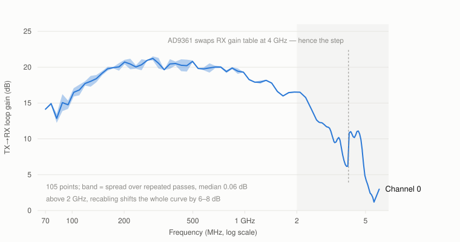

# What this board actually measures

Every number here came off one unit with `tools/selftest/sdr_selftest.py`, over
six runs: both TX/RX channel pairs, each looped back through a 20 dB, a 30 dB
and a 50 dB attenuator. Recording it three ways was not thoroughness for its own
sake — it is what separates a property of the *board* from a property of the
*cable*, and the two are easy to confuse.

Firmware [v1.1](../../releases/tag/v1.1), room temperature, one afternoon, one
board. Read the [caveats](#what-these-numbers-are-not) before quoting any of it.

## The short version

The board is well behaved and the two channels are closely matched. Programmable
gain does what it says to within 1.4%, the transmitter is clean, and the FPGA has
most of its capacity free.

| | |
|---|---|
| **Gain accuracy** | 12 slope measurements, every one within **1.4% of unity** |
| **Image rejection** | **55–63 dBc** after calibration (41–48 dBc as found) |
| **Harmonic distortion** | **−67 to −79 dBc** |
| **Transmit power** | **+19 dBm** flat out, agreeing to 0.7 dB across six runs |
| **Transmit mute depth** | **63–70 dB**, into the noise floor |
| **Supply rails** | all six within **1.1%** of nominal |
| **FPGA** | 72 of 220 DSP48s used, timing met with **+0.214 ns** to spare |

## Gain accuracy — the number that matters most in practice

| | ch0@20 | ch1@20 | ch0@30 | ch1@30 | ch0@50 | ch1@50 |
|---|---|---|---|---|---|---|
| TX attenuator, dB per dB | 0.999 | 1.007 | 1.003 | 0.998 | 1.012 | 1.016 |
| RX gain, dB per dB | 0.998 | 0.998 | 1.003 | 0.986 | 1.007 | 0.992 |

Worst-case deviation from an ideal 1.000 across all twelve: **1.6%**, and worst
residual from the straight-line fit **0.16 dB**.

This is the figure to care about if you are doing anything quantitative. It means
**a link budget you compute is the one you get**: ask for 6 dB less and you get
6.0, not 5.2. Calibrations hold, and a measurement taken at one gain setting can
be compared against one taken at another without a correction table.

The RX figure is quoted over 38–51 dB, which is deliberate. The AD9361's gain
table changes its LNA/mixer state at several indices, and the real gain steps by
up to 10 dB there while the label still claims 1 dB. Fit a line across the whole
range and a perfectly healthy front end reports 0.65 dB per dB. 38–51 dB is the
widest window with no such transition in it, and it is the only span where the
question "is the gain control linear?" has a meaningful answer.

## Transmit chain

| | ch0@20 | ch1@20 | ch0@30 | ch1@30 | ch0@50 | ch1@50 |
|---|---|---|---|---|---|---|
| Image rejection, recalibrated (dBc) | 55.5 | 62.7 | 60.2 | 58.0 | 54.9 | 54.8 |
| Image rejection, as found (dBc) | 41.6 | 41.3 | 47.3 | 44.3 | 44.2 | 41.1 |
| 2nd harmonic (dBc) | −70.3 | −66.8 | −68.6 | −73.2 | −71.5 | −73.2 |
| Mute depth (dB) | 69.8 | 62.7 | 70.4 | 65.0 | 65.3 | 63.0 |
| Power flat out (dBm) | +19.0 | +19.0 | +19.0 | +19.0 | +18.3 | +19.0 |

**Image rejection degrades between calibrations.** As found it sits around
41–48 dBc; immediately after a forced TX quadrature calibration it is 55–63.
That is a 14 dB difference on the same hardware minutes apart, and it is worth
knowing if you care about the mirror image of a strong signal landing on a weak
one. If you do, recalibrate rather than assume the datasheet figure — the
self-test does exactly this before measuring, which is why it reports both.

**The transmitter really does go quiet.** Closing a DMA stream drops output by
63–70 dB, into the noise floor. Measured separately at 900 MHz with the receive
LO offset by 1 MHz so leakage could be told apart from the receiver's own DC
offset: muting the attenuators leaves residual LO 26 dB above the floor, and
powering the synthesiser down as well takes it a further **19.9 dB** to within
6 dB of the floor — about −89 dBm at the port. Both mechanisms earn their place;
neither is sufficient alone. See [Transmitter safety](../README.md#transmitter-safety).

## Frequency response, and the limits of measuring it this way

<picture>
  <source media="(prefers-color-scheme: dark)" srcset="img/loop-gain-dark.svg">
  
</picture>

The board's own TX→RX transfer, with the external attenuator subtracted
arithmetically so the three cable configurations can be compared. The line is
the median of the three; the band is their spread.

| MHz | 100 | 300 | 700 | 1200 | 1800 | 2400 | 3500 | 5000 |
|---|---|---|---|---|---|---|---|---|
| **Channel 0** (dB) | +16.6 | +19.5 | +19.6 | +18.3 | +16.1 | +14.2 | +10.9 | +5.4 |
| **Channel 1** (dB) | +17.4 | +21.9 | +21.2 | +19.8 | +17.8 | +16.6 | +10.8 | +8.6 |
| spread across pads, ch0 | 1.4 | 1.7 | 3.4 | 2.1 | 0.4 | 5.4 | 1.7 | 6.5 |
| spread across pads, ch1 | 1.2 | 1.0 | 0.9 | 1.4 | 1.0 | 1.7 | 3.4 | 7.5 |

The shape is real: gain peaks in the low UHF range where the PA is strongest and
falls away above 2 GHz, which is what a PGA-102+ and a wideband balun should do.

**The spread is the more useful result.** Below 2 GHz the three cable
configurations agree to about 1–2 dB — so a measurement there is telling you
about the board. At 5 GHz they disagree by 6–8 dB, which is not the board
changing between runs: it is SMA connector repeatability across three
recablings. Above 2 GHz, absolute path loss measured this way is dominated by
your cable.

That is precisely why the self-test compares against a **baseline you record
yourself with your own cable**, rather than against absolute thresholds. An
absolute pass/fail band at 5 GHz would be meaningless.

## How well the tool knows your attenuator

The self-test infers how much attenuation is in the loop and checks it against
what you declared. Six runs at three known values:

| Declared | 20 dB | 20 dB | 30 dB | 30 dB | 50 dB | 50 dB |
|---|---|---|---|---|---|---|
| Measured | 21 | 19 | 30 | 29 | 54 | 51 |
| Error | +1 | −1 | 0 | −1 | **+4** | +1 |

Five of six within ±1 dB; one at +4 dB. The estimate is documented as ±3 dB, and
on this evidence **±4 dB is the honest figure** at the high-attenuation end,
where the loop is weakest and the estimate leans hardest on assumed constants.
It is used to catch a missing or wrong attenuator — a failure that destroys
receivers — and the check only fires above 8 dB of disagreement, so 4 dB of
error costs nothing.

## Digital and power

| | |
|---|---|
| Digital interface eye | 157–181 of 256 clock/data delay positions pass |
| Internal digital loopback | tone returns at the amplitude sent, spurious-free by >120 dB |
| Supply rails | vccint 0.995 V, vccaux 1.783 V, vccbram 0.997 V, vccpint 0.992 V, vccpaux 1.780 V, vccoddr 1.342 V |
| Die temperature | Zynq 65–70 °C, AD9361 42–47 °C |

The eye scan is the AD9361 walking all 16×16 clock and data delay combinations
with a PRBS running. 157–181 passing positions is a wide margin; a link on the
edge of working shrinks that number long before it starts corrupting samples.

## What these numbers are not

- **One board, one afternoon, one temperature.** Nothing here is a
  specification, a guarantee, or a sample of production spread.
- **Loopback measures TX and RX together.** Image rejection is the combination
  of both chains' quadrature balance, not either one alone.
- **Absolute power rests on a calibration assumption** — receive full scale
  taken as +2.5 dBm at 0 dB gain — so treat the dBm figures as ±3 dB. The
  *ratios* (slopes, dBc, mute depth) carry no such assumption and are the
  trustworthy part.
- **Above 2 GHz the frequency response is cable-dominated**, as the spread shows.

## Reproducing it

```bash
cd tools/selftest
./sdr_selftest.py --ssh                                    # no cable, never transmits
./sdr_selftest.py --ssh --loopback --pad 30 --channel 0     # add the RF tests
```

Fit **at least 20 dB** of attenuation in any loopback: this board reaches about
+19 dBm and its own receive port is rated to +2.5 dBm. Details in
[`tools/selftest/README.md`](../tools/selftest/README.md).
